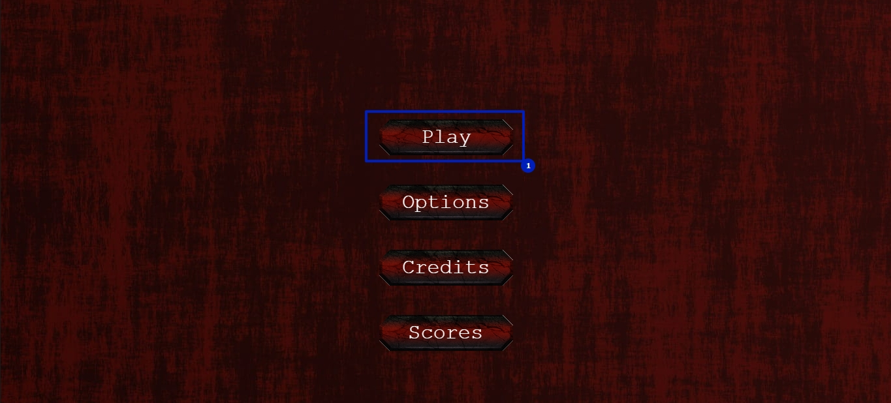
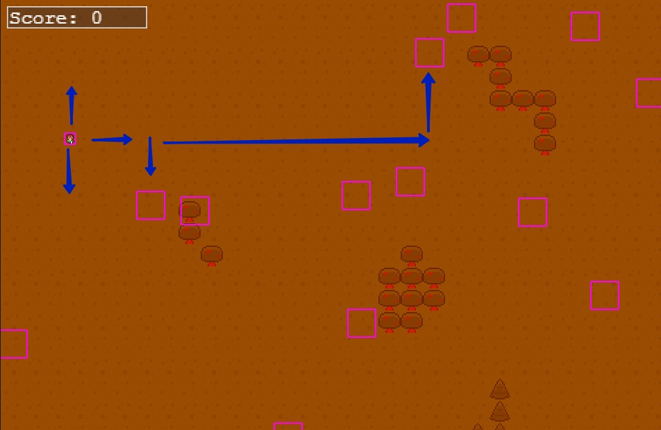
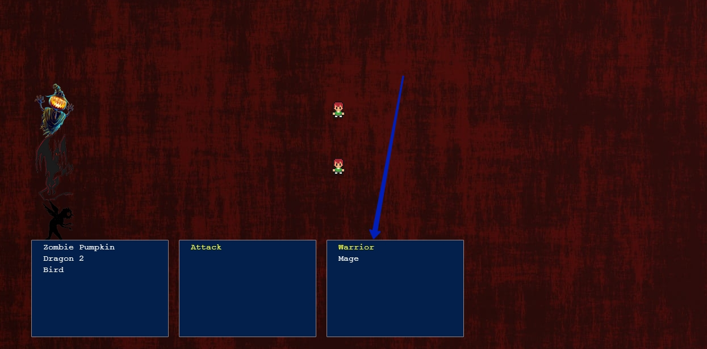
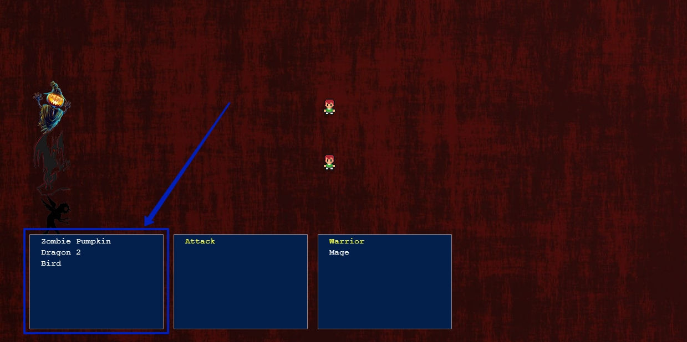
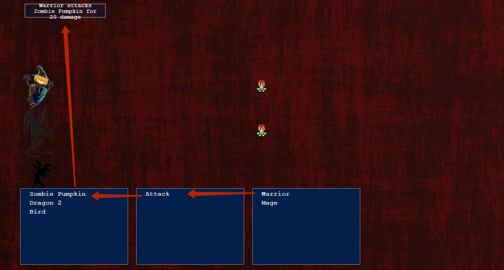

# Javascript Capstone Project using Phaser 3 framework - A Microverse educational project

Building RPG game using JavaScript and Phaser 3 to build the entire game manipulating DOM elements using JS modules.

## Screenshots

* [Boot scene](src/assets/images/1.png)
* [Main menu](src/assets/images/2.png)
* [Battle scene](src/assets/images/3.png)
* [Score board](src/assets/images/4.png)

## Live Demo

[Live Demo](https://internal-fears.netlify.app/)

## Gameplay

Species fears have become the main disaster for all the worlds that exist in the universe. Especially, it was hard for people to control their fears. Also, the magic world had devastative attacks by their imagination and their fears. 

Fears absorbing all the species from inside making them miserable, helpless, and unhappy. All children live only in fear. 

All the fears are controlled by the Thing. He could read minds, make the inception of nightmares, and the saddest thoughts about everything in the universe. What's more, all these thoughts are becoming real. 

Even all the united power of the mages and a lot of different species could not conquer the Thing. Species live like in a dark cloudy world where everything is connected with the pain and depression. 

The Thing has three servants: The Zombie Pumpkin, Dragon, and Bird.

Many years there were no heroes to conquer the Thing and his servants. However, some rebels learnt to control their fears and imaginations, to alter the thoughts for the Thing. The most powerful resistance was shown by the human born boy called Warrior and the Mage from the magic world. And they started hunting for the servants of the Thing...

## How to play

- Click the Play button in the main menu

- Enter your name

- Go to the portals to reach the clones of the servants using right, left, up and down keys in the keyboard

- Select the player with whom to attack the Thing's servants

- Select the servant to attack 

- Attack the servant by pressing the spacebar or left key

## Built With

-   HTML5
-   CSS3
-   Javascript
-   Phaser 3
-   Webpack
-   Jest

## Getting Started

### Prerequisites

- Using NPM package manager, JavaScript, webpack configs, deployment to Netlify/Heroku to build, making tests using Jest framework

### Installation

- Fork the repository and create a local one on your computer
- Run npm install to run all of the dependencies into your local repository
- Run the command 'run npm start' to start the game running into your local machine
- open http://localhost:8080/ on your browser

## Acknowledgments

- Red background by Pxfuel
- Castle illustration by BelleDeesse
- Bird by StarGladeVintage
- Dragon by Pinclipart
- Zombie pumpkin by Pxfuel
- Buttons sprites Nia Mi
- Background sound by Epic Sounds
- Bat animation video by Unknown author

## Authors

👤 Nurislam Ab
- Github: [@nurislam-ab](https://github.com/nurislam-ab)
- Twitter: [@NurislamAb](https://twitter.com/NurislamAb)
- Linkedin: [nurislam-ab](https://www.linkedin.com/in/nurislam-ab/)

## 🤝 Contributing

Contributions, issues, and feature requests are welcome!

## 📝 License

This project is [MIT](LICENSE) licensed.
